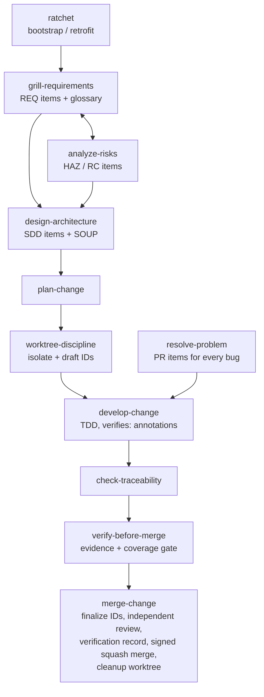

# guardrails

Agent skills for managing and developing software projects under
**IEC 62304** (medical device software lifecycle) and **ISO 14971**
(risk management), with mechanically checked traceability, mandatory git
worktrees, and signed squash merges. Borrows DO-178C's strongest mechanics:
high/low-level requirements, derived-requirements feedback into risk
analysis, problem reports, structural-coverage targets, independent review,
and verification records.

> Guardrails supports your quality management system; it is **not** itself
> regulatory compliance. Your quality manual, design controls, and human
> sign-offs govern.

## Install

Via the [skills CLI](https://skills.sh) (Claude Code, Cursor, Codex, and
other agents):

```sh
npx skills add Jan-Jan/guardrails
```

Or manually:

```sh
git clone git@github.com:Jan-Jan/guardrails.git
cd guardrails
./install.sh          # symlinks skills into ~/.claude/skills
                      # (CLAUDE_SKILLS_DIR overrides; --copy for a static copy)
```

Then, in the project you want to bring under guardrails, run the **ratchet**
skill (`/ratchet`). It bootstraps a new project — or audits an existing one
and tightens incrementally — installing `AGENTS.md` rules, `.guardrails/`
config and check scripts, and the document skeletons, and finishing with a
checklist of things only a human can set up (signing keys, branch
protection, CI).

## The workflow



Three rules carry the whole system:

1. **All work happens in worktrees** — documentation and code alike. The
   base branch (whatever the primary checkout has checked out — the scripts
   detect it, nothing assumes `main`) never moves except by merge.
2. **Integration is a signed squash merge** — the base branch is one signed,
   verified, auditable commit per change.
3. **Traceability is mechanical** — grep-able IDs link requirements, risks,
   design, and tests; scripts gate every merge.

## ID and trace grammar

| Item | Defined in | Grammar |
|---|---|---|
| Requirement | `docs/requirements/srs.md` | `**REQ-NNN**: The software shall … (implements: RC-NNN)` |
| Hazard | `docs/risk/rmf.md` | `**HAZ-NNN**: hazard, situation, harm. Severity: S_. Probability: P_.` |
| Risk control | `docs/risk/rmf.md` | `**RC-NNN**: control. mitigates: HAZ-NNN` |
| Design item | `docs/architecture/sad.md` | `**SDD-NNN**: item. traces: REQ-NNN` |
| Low-level req | `docs/architecture/sad.md` | `**LLR-NNN**: behavior. satisfies: REQ-NNN` (or `satisfies: derived` — must then be assessed in the RMF) |
| Problem report | `docs/problems/log.md` | `**PR-NNN**: symptom. affects: <IDs>. status: open\|resolved` |
| Test link | test files | comment/name containing `verifies: <IDs>` — lowest level present; REQs covered transitively via tested LLRs |

New items minted inside a worktree use **draft IDs**
(`<PREFIX>-DRAFT-<branch>-<n>`); `finalize-ids.sh` assigns the next
sequential numbers at merge time and rewrites every reference — parallel
worktrees can never collide on an ID.

**Document ledgers:** each doc area is a directory of per-change files, not
a monolith — so parallel worktrees never conflict on documents either. In a
worktree, new items go into `docs/<area>/DRAFT-<branch>-<slug>.md`;
`merge-change` renames it to `YYYY-MM-DD-<slug>.md` (the merge date, so
`ls` reads chronologically; same-day collisions get `-2`). Existing items
are always edited in the dated file that defines them. Each directory's
README carries the grammar; `soup.md` stays a single inventory file, and
every `doc_*` config key also accepts a single file (legacy monoliths keep
working).

## Check scripts

Source of truth in `scripts/`; `/ratchet` copies them into target projects
at `.guardrails/scripts/`. POSIX sh + git/grep/awk/sed only.

| Script | Purpose |
|---|---|
| `check-ids.sh [--allow-drafts] [--base REF]` | no leftover draft IDs or draft-named files, no duplicate IDs. Prints `SKIPPED-DUPLICATE-BASE` and leaves the duplicate-vs-base gate unrun when there is no usable base branch (a detached HEAD, or one with no commits yet); a `--base` you name yourself must resolve. Also prints `UNANCHORED-DEF` — a report, not a violation, and never a failure — for a definition-form token off column one whose number is above the highest ID actually defined, and `UNANCHORED-DEF-UNREADABLE` when a newline in a filename stops that scan running at all |
| `check-trace.sh` | every REQ/LLR tested (transitive REQ coverage), HAZ mitigated, RC implemented, SDD traced, LLR satisfied-or-derived, derived items assessed in RMF; no dangling refs; open PRs listed as warnings. Ends with `checked:` (items found) and `sources:` (document files read, then the number of configured path entries) |
| `check-signing.sh [--strict] [RANGE]` | commit signatures verified |
| `finalize-ids.sh [--dry-run] [--base REF]` | mint final IDs, rewrite references, rename draft ledger files to merge date; exits 1 without touching anything if a draft ID could never be minted — no bold item header, or a prefix missing from `id_prefixes` (`--dry-run` reports this too) |

Annotations are read as lists: only the IDs immediately following the first
occurrence of `verifies:`/`mitigates:`/`implements:`/`satisfies:`/`traces:`
count, so `verifies: REQ-001 (was REQ-042)` credits REQ-001 alone. The rule
has one definition, shared by every keyword.

**A configured entry that matches nothing is an error, not an empty result.**
Exit 2 — never a quiet exit 0 — for a `doc_*`, `strict_paths` or `test_paths`
entry matching no file present in the working tree, a ledger directory holding
no `*.md`, or an `id_prefixes` entry that is not a bare identifier.
`strict_paths` and `test_paths` entries are **git pathspecs** — a plain path,
or a pattern like `*_test.sh` that git matches recursively — and an empty
directory matches no file. `doc_*` values are plain paths only: a file, or a
directory whose `*.md` files sit directly in it.

Every one of those would otherwise turn a whole gate family into a no-op that
still reports success.

**The config itself is validated.** A key that is misspelled, not
`identifier:` at column one, or hidden behind a UTF-8 BOM is invisible to the
config reader — so the gate it was meant to configure would never run, and the
run would still exit 0. Every such shape is exit 2, as is an `id_prefixes` list
naming none of the six prefixes that have a traceability gate, or a declared
prefix whose gate inputs are unconfigured. An **extra** prefix alongside the
six is fine and is still checked — `DANGLING-REF`, `DUPLICATE-ID` and ID
finalization are keyed on the whole prefix list.
There is no compatibility flag, deliberately: almost all of these were a gate
that did not run. The exception is an unrecognised key, which may be a
project-local annotation rather than a typo — the two are indistinguishable
from here, and guessing wrong on a typo is the failure this exists to stop.
Every gate that reads the config validates it, `check-ids.sh` included — it
was the one exception, so a project running only that gate got no validation
at all.

**The scans exclude `.guardrails/scripts/`, and nothing else.** The installed
scripts carry a draft token and definition-form examples in their own comments,
so the gates they implement must not read them. That exclusion used to cover
the whole `.guardrails/` tree, which also hid anything a project kept there:
with `doc_srs: .guardrails/docs/requirements`, `finalize-ids.sh` renamed the
draft ledger to its merge-date name, minted no ID, and exited 0, and both check
scripts then passed a tree holding a live `REQ-DRAFT-x-1`. Ledgers under
`.guardrails/` are read normally now.

`.guardrails/scripts/` stays invisible to the scans, and so do `.git/`,
gitignored paths, and symlinks pointing outside the repository. A `doc_*` aimed
at one of those is **accepted**: `checked:` counts its items as zero, and
`finalize-ids.sh` renames a draft ledger there without minting anything.

Whether anything warns you first depends on the location, on whether git tracks
or ignores the file, and on whether finalization has already run. Some
combinations are silent throughout; others raise a complaint that names no
cause, which finalization then removes. The measured matrix is in
`docs/verification/2026-08-20-scan-pathspec.md`; it is too conditional to
summarise safely, and three attempts to summarise it here were each wrong in a
new way. Do not configure a ledger in any of those locations.

A symlink to a directory *inside* the repository is different: it is scanned
normally under the target's real path, so its items are counted, its placement
is checked, and its drafts are minted.

**Items must live where their gates look.** `MISPLACED-ITEM` closes what was a
recorded gap: `checked:` used to count items found, not items examined, so
`**SDD-001**:` written in `docs/design.md` — with no `traces:` line at all —
was counted there while the gate that would convict it never parsed its block.
Each of the six gated prefixes is now
checked against the one document it may be defined in (`REQ`→`doc_srs`,
`HAZ`/`RC`→`doc_rmf`, `SDD`/`LLR`→`doc_sad`, `PR`→`doc_problems`), so while
that gate is green every counted item sits somewhere a gate opened. A `doc_*`
directory resolves to its `*.md` files one level deep, so an item in a
subdirectory of one is reported — and so is one in a `.txt` sitting directly
in it; a `doc_*` configured as a single file resolves to that file whatever its
extension. What a misplaced item loses is not enumeration — `MISSING-TEST` and
the rest still fire on it — but the gate that would convict it on its own
annotations, which parses the configured document alone. Two caveats: `DANGLING-REF`
scans every `doc_*` file plus `strict_paths` and `test_paths`, so an item
misfiled into another ledger still has its reference IDs read — by that gate,
not by its own; and a `HAZ` block carries no annotation of its own that a gate
parses, yet moving it out of the RMF still blinds `UNANALYZED-DERIVED`, which
greps the RMF as free text.

The remedy is to move the definition into the configured document. For an ID
that appears at column one in illustrative text — a plan, a changelog, a
README example — the remedy is the opposite: stop using a real three-digit ID
there and write `**REQ-NNN**:`, which no scan matches.

**One definition form, and every gate reads it the same way.** A definition is
a bold ID followed immediately by a colon **at line start** — nothing else is
one. `check-ids.sh` decides what is a duplicate, `finalize-ids.sh` decides what
number comes next, and `check-trace.sh` decides what exists at all; all three
build their **shell** patterns from a single constructor (`gr_def_re`), with one
exception: the scan that asks whether the base branch already defines a
particular ID carries that ID literally, so it anchors by hand and is held in
step by a test instead. `check-trace.sh`'s four block parsers — spelled by eight patterns, an opener
and a closer each — and the scan in `check-ids.sh` are awk, which has no
portable `{3,}`, so they spell the form out a second time and are held in step
by tests instead: weaker than shared source, and named here rather than glossed
over. They did drift: `finalize-ids.sh` alone matched the form *anywhere on a
line*, so a backticked `` `**PR-900**:` `` in prose silently minted the next
problem report as `PR-901` while both gates that anchor saw nothing to report.
A token in that position defines nothing now. Where it used to hold a number
reserved, `check-ids.sh` prints `UNANCHORED-DEF` for it — but only where the
number is **above the highest ID actually defined**, since those are the only
ones whose reservation this change drops. On a real 300-item project, reporting
every off-column token gave nine lines of ordinary prose (`Resolves **PR-006**:
…`) and not one that reserved anything; with the rule as shipped it gives none.
The line reports without failing: in every case seen the token was prose about
an item rather than a claim to be one.

Relatedly, a definition **moved** between files in one change is not a
duplicate — which is what this has always said, but it held only while exactly
one definition moved. Two at once were reported as duplicates of themselves,
blocking the merge with no legal way forward.

**What this does not yet cover.** Placement covers the six gated prefixes only.
An extra prefix declared alongside them has no configured document, so its
items are still counted without being examined.

Safety-class awareness (IEC 62304 A/B/C) lives in `.guardrails/config.yaml`;
skills scale required documentation and verification to the class.

## Development

```sh
tests/run-tests.sh    # bats suite for the scripts (vendors bats-core if needed)
```

Guardrails is developed under its own rules — see `AGENTS.md`.

## Credits

Process discipline adapted from [obra/superpowers](https://github.com/obra/superpowers)
(worktrees, TDD, verification-before-completion, plan writing) and interview
style from [mattpocock/skills](https://github.com/mattpocock/skills)
(`grilling`, `domain-modeling`, `grill-with-docs`) — both MIT licensed.

## License

MIT © Dr. Jan-Jan van der Vyver — see [LICENSE](LICENSE).
