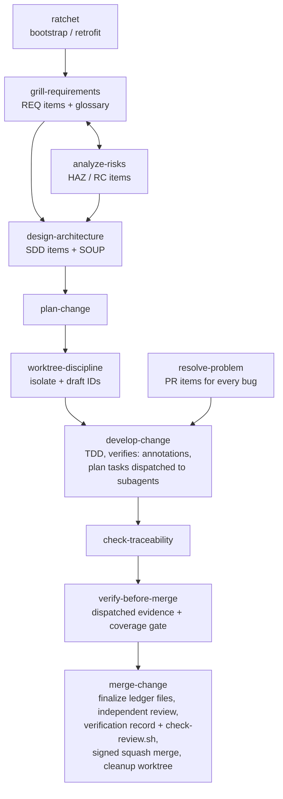

# guardrails

Agent skills for managing and developing software projects under
**IEC 62304** (medical device software lifecycle) and **ISO 14971**
(risk management), with mechanically checked traceability, mandatory git
worktrees, and signed squash merges. Borrows DO-178C's strongest mechanics:
high/low-level requirements, derived-requirements feedback into risk
analysis, problem reports, structural-coverage targets, independent review,
and verification records.

> Guardrails supports your quality management system; it is **not** itself
> regulatory compliance. Your quality manual, design controls, and human
> sign-offs govern.

## Install

Via the [skills CLI](https://skills.sh) (Claude Code, Cursor, Codex, and
other agents):

```sh
npx skills add Jan-Jan/guardrails
```

Or manually:

```sh
git clone git@github.com:Jan-Jan/guardrails.git
cd guardrails
./install.sh          # symlinks skills into ~/.claude/skills
                      # (CLAUDE_SKILLS_DIR overrides; --copy for a static copy)
```

Then, in the project you want to bring under guardrails, run the **ratchet**
skill (`/ratchet`). It bootstraps a new project — or audits an existing one
and tightens incrementally — installing `AGENTS.md` rules, `.guardrails/`
config and check scripts, and the document skeletons, and finishing with a
checklist of things only a human can set up (signing keys, branch
protection, CI).

## The workflow



Three rules carry the whole system:

1. **All work happens in worktrees** — documentation and code alike. The
   base branch (whatever the primary checkout has checked out — the scripts
   detect it, nothing assumes `main`) never moves except by merge. One change
   gets one change worktree on one change branch, and that is the only worktree
   `merge-change` ever sees.
2. **Integration is a signed squash merge** — the base branch is one signed,
   verified, auditable commit per change. The agent stages the squash and hands
   the user a single command; the user signs it, and `finish-merge.sh` refuses
   to remove the worktree or delete the branch until the signature verifies
   under `--strict` and the squash provably captured everything the change
   branch held.
3. **Traceability is mechanical** — grep-able IDs link requirements, risks,
   design, and tests; scripts gate every merge.

Within a change, the main agent orchestrates rather than implements. Each plan
task is dispatched to a subagent that works in its own task worktree, on a task
branch off the change branch; it commits there and returns a dispatch report.
Merging that task branch into the change branch, and removing the task worktree
and branch afterwards, is the dispatcher's job — the agent in the change
worktree, which is the only one that may move the change branch. So the base
branch still sees exactly one signed squash per change. The verification gate is
dispatched the same way: the subagent runs the checks and returns a gate
summary, while its raw log stays outside the tree, where the documentation
gates cannot mistake a quoted item ID in a test name for an item. Changes are
sequential — one reaches its signed squash before the next is opened;
parallelism lives inside a change, across tasks whose file sets do not
intersect.

## ID and trace grammar

| Item | Defined in | Grammar |
|---|---|---|
| Requirement | `docs/requirements/srs.md` | `**REQ-a3k9z2**: The software shall … (implements: RC-c5t8bd)` |
| Hazard | `docs/risk/rmf.md` | `**HAZ-h7z4mn**: hazard, situation, harm. Severity: S_. Probability: P_.` |
| Risk control | `docs/risk/rmf.md` | `**RC-c5t8bd**: control. mitigates: HAZ-h7z4mn` |
| Design item | `docs/architecture/sad.md` | `**SDD-d2s6fk**: item. traces: REQ-a3k9z2` |
| Low-level req | `docs/architecture/sad.md` | `**LLR-b4r7pq**: behavior. satisfies: REQ-a3k9z2` (or `satisfies: derived` — must then be assessed in the RMF) |
| Problem report | `docs/problems/log.md` | `**PR-p9r5wx**: symptom. affects: <IDs>. status: open\|resolved` |
| Test link | test files | comment/name containing `verifies: <IDs>` — lowest level present; REQs covered transitively via tested LLRs |

**IDs are random tokens, minted once.** An item gets its ID the moment it is
written — `new-id.sh REQ` prints `REQ-a3k9z2` — and that ID is allocated
against nothing, so two worktrees, or two GitHub PRs, can never contend for
one and nothing is renumbered at merge. The token is six characters of an
alphabet that drops the pairs a reader confuses (`0`/`o`, `1`/`l`/`i`) and
always carries at least one digit, which is what keeps `REQ-argued` in prose
from reading as an ID. It is deliberately **not** a content hash: a hash
changes when the item text is edited, and every reference to it breaks.
Sequential IDs from before this scheme keep working permanently — every
pattern accepts both forms, and nothing converts an existing SRS.

**Document ledgers:** each doc area is a directory of per-change files, not
a monolith — so parallel worktrees never conflict on documents either. In a
worktree, new items go into `docs/<area>/DRAFT-<branch>-<slug>.md`;
`merge-change` renames it to `YYYY-MM-DD-<slug>.md` (the merge date, so
`ls` reads chronologically; same-day collisions get `-2`). Existing items
are always edited in the dated file that defines them. Each directory's
README carries the grammar; `soup.md` stays a single inventory file, and
every `doc_*` config key also accepts a single file (legacy monoliths keep
working).

## Check scripts

Source of truth in `scripts/`; `/ratchet` copies them into target projects
at `.guardrails/scripts/`. POSIX sh + git/grep/awk/sed only.

| Script | Purpose |
|---|---|
| `new-id.sh PREFIX [COUNT]` | mint item IDs. Redraws a candidate that already occurs anywhere in the tree, tracked or untracked; refuses a prefix that is not declared in `id_prefixes`, and refuses to invent one at all when there is no entropy source rather than falling back to the pid and the clock |
| `check-ids.sh [--allow-draft-files]` | no draft ID tokens (always fatal — nothing mints one any more), no draft-named ledger files unless the flag is given, no duplicate IDs, and no `MALFORMED-ID`: a line opening with a definition form whose body is not a valid ID, which no other gate can see |
| `check-trace.sh` | every REQ/LLR tested (transitive REQ coverage), HAZ mitigated, RC implemented, SDD traced, LLR satisfied-or-derived, derived items assessed in RMF; no dangling refs; no `ORPHAN-ANNOTATION` (an annotation belonging to no item); every problem report states a `status:`, and every open one an `owner:` and an `opened:` date; open PRs listed as warnings, and failed past the configured `problem_age_days` / `problem_open_max` limits. Ends with `checked:` (items found), `problems:` (open count, oldest, and both limits — set or not) and `sources:` (document files read, then the number of configured path entries) |
| `check-review.sh [--branch NAME]` | the change under merge has a verification record that declares it and that this change wrote (`MISSING-RECORD`, `STALE-RECORD`), that record names a `reviewer:`, a `verdict:` and what was `reproduced:` (`INCOMPLETE-RECORD`), and every `**finding-N**:` the reviewer raised carries a `disposition:` (`UNDISPOSED-FINDING`, plus `MALFORMED-FINDING` and `ORPHAN-DISPOSITION` for the headers and annotations that would otherwise detach one). Ends with `checked:` (records read, records for this change, findings, and whether provenance was checked). Run on the base branch it exits **2**, never 0 — there is no change under review there |
| `check-signing.sh [--strict] [RANGE]` | commit signatures verified. `--setup` instead *proves the project can produce a verifiable signature*: every setting present (`gpg.format`, `user.signingkey`, `commit.gpgsign`, `user.email`, and the format's trust root), each missing one named on its own line, then a real signed commit made in a throwaway repository and read back at `%G?` = `G`. `ratchet` will not complete until it passes |
| `finish-merge.sh BRANCH` | the guarded half of the merge command the user runs. Before it removes anything: the signature verifies under `--strict`, `git diff --quiet HEAD BRANCH` proves the squash captured everything the change branch held, and `git worktree remove` runs *without* `--force` so git's own refusal of a dirty worktree is the third guard. Only then the worktree goes and the branch is force-deleted. Any refusal leaves both intact — the signed commit always survives |
| `finalize-docs.sh [--dry-run]` | rename this change's draft ledger files to their merge-dated names. There are no IDs to finalize; this script was `finalize-ids.sh` until the token scheme landed |

Annotations are read as lists: only the IDs immediately following the first
occurrence of `verifies:`/`mitigates:`/`implements:`/`satisfies:`/`traces:`
count, so `verifies: REQ-001 (was REQ-042)` credits REQ-001 alone. The rule
has one definition, shared by every keyword.

Annotations are read *within an item*. An item **opens** at its definition
form and **closes** at the next markdown heading or the next **bold line
carrying a colon** — `**PR-a3k9z2**:`, `**ADR-0007**:`, `**Decision 7**:`,
`**LLR-overflow:**` and an ordinary label like `**Rationale**:` all end an
item, whatever their prefix and whether or not they are items themselves.
`**21 of 35 inverted, 14 not.**` carries no colon, so it ends nothing — and
that is the rule's one limit: a bold line carrying **no ASCII colon** does not
close, because nothing distinguishes it from that sentence. The close is
byte-wise, so it does not shift with the reader's awk or locale. Give a colon to
any header you want honoured, and put annotations *above* a bold label rather
than below it.

Closing is deliberately broader than opening, and asymmetric on purpose: a line
a reader takes for a header must never hand its annotations to the item above
it, while only a well-formed ID may start one. `check-ids.sh` separately
reports `**REQ-abcdef**:` as `MALFORMED-ID`. An annotation that falls outside
every block is reported as `ORPHAN-ANNOTATION` rather than dropped —
`status:`, `traces:` and `satisfies:` only, in the documents where each is
block-parsed, at column one, and scoped to the prefix whose gate reads it. This
rule too has one definition, shared by all five gates that need it.

### The review artefact

Independent review (`merge-change` step 6a) is the highest-yield step in the
sequence and was the only one with nothing behind it: no check that a reviewer
was dispatched, that findings were answered, or that the verdict recorded
corresponds to anything. `check-review.sh` closes the omission case.

It judges **presence, never quality**. It cannot know whether a review was good,
and it deliberately does not test whether the reviewer was independent of the
author — with agent reviewers the identity string is whatever the author types,
and a gate keyed on it would be theatre. Independence is what step 6a is for.

The record is found by **content, not filename**: it carries a `branch:` line
naming the change it covers, matched whole — and it must be the FIRST such line
in the file, so that a record quoting `branch: other-change` in an example or a
fenced block does not become the record for that change. A branch name carries
no identity of its own, so the record must also be one **this change wrote**:
committed on this branch since it left the base, modified in the working tree,
or not yet tracked. Without that, a reused branch name lets the previous
change's record answer for this one, and the summary line says whether the
check ran. `reviewer:`, `verdict:` and
`reproduced:` must each carry a value — a keyword with nothing after it is an
omission wearing the shape of compliance. `reproduced:` exists so that the
absence of evidence is a visible omission rather than an optional act of
honesty, and **its value is never judged**: `reproduced: no — the root cause was
measured directly` is a passing record.

A finding is an item block in the same shape as every other ledger item, so
where it starts and ends is the shared rule and not a new one; `disposition:` is
a plain column-one annotation for the same reason `status:` is — written in
bold it would close the very finding it belongs to. Every near-miss on a finding
header is reported rather than dropped: a missing colon, a missing hyphen, an
indented header or an unreadable label all make a finding vanish and hand its
disposition to the finding above, so `MALFORMED-FINDING` names the shape and
`ORPHAN-DISPOSITION` catches whatever the shape rule cannot — the same backstop
`ORPHAN-ANNOTATION` provides for ledger items. Both tests are byte-wise; a
regex there failed open under gawk in a multibyte locale on a latin-1 label. Two limits are stated rather
than papered over: only the record for the change under merge is checked, so
records written before this schema existed are left alone; and `doc_verification`
is the one document key with a default (`docs/verification`), which is safe only
because an absent directory is exit 2 rather than an empty scan.

**A configured entry that matches nothing is an error, not an empty result.**
Exit 2 — never a quiet exit 0 — for a `doc_*`, `strict_paths` or `test_paths`
entry matching no file present in the working tree, a ledger directory holding
no `*.md`, or an `id_prefixes` entry that is not a bare identifier.
`strict_paths` and `test_paths` entries are **git pathspecs** — a plain path,
or a pattern like `*_test.sh` that git matches recursively — and an empty
directory matches no file. `doc_*` values are plain paths only: a file, or a
directory whose `*.md` files sit directly in it.

Every one of those would otherwise turn a whole gate family into a no-op that
still reports success.

**The config itself is validated.** A key that is misspelled, not
`identifier:` at column one, or hidden behind a UTF-8 BOM is invisible to the
config reader — so the gate it was meant to configure would never run, and the
run would still exit 0. Every such shape is exit 2, as is an `id_prefixes` list
naming none of the six prefixes that have a traceability gate, or a declared
prefix whose gate inputs are unconfigured.

The same reasoning reaches past a key's *name* to its **value**, and each of
these was found by asking one more time how a key could fail to take effect
while the run still exited 0:

| shape | what the gate then does |
|---|---|
| the key is set to nothing — `strict_paths:` with its items commented out | walks no path, and a reference to an undefined ID is never looked for |
| the key is in the wrong form — `strict_paths: src`, or `doc_soup:` with `  - items` under it | reads nothing at all; a list key is read by `cfg_list` and a scalar by `cfg_get`, and neither finds the other's shape |
| the key is set twice | takes the first block; YAML takes the last, so one of the two is read by nobody |
| an item is only a comment — `  - # make test` | runs it, and the shell treats it as a comment: nothing runs, nothing fails |
| an item has nothing after its `-` | drops it, so the list that takes effect is shorter than the one written |
| the file has bare-CR line endings | reads the whole file as one record, so every key but the first is invisible |
| `strict_paths` is absent altogether | the same as empty — which is why it is required, and why the emptiness message does not offer deletion as the remedy |

A CRLF file is read correctly rather than truncated at the first blank line
inside a list. None of these is a compatibility break in the usual sense: each
was already a gate reading less than it was configured to. An **extra** prefix alongside the
six is fine and is still checked — `DANGLING-REF`, `DUPLICATE-ID` and ID
finalization are keyed on the whole prefix list.
There is no compatibility flag, deliberately: almost all of these were a gate
that did not run. The exception is an unrecognised key, which may be a
project-local annotation rather than a typo — the two are indistinguishable
from here, and guessing wrong on a typo is the failure this exists to stop.
Every gate that reads the config validates it, `check-ids.sh` included — it
was the one exception, so a project running only that gate got no validation
at all.

**The scans exclude `.guardrails/scripts/`, and nothing else.** The installed
scripts carry a draft token and definition-form examples in their own comments,
so the gates they implement must not read them. That exclusion used to cover
the whole `.guardrails/` tree, which also hid anything a project kept there:
with `doc_srs: .guardrails/docs/requirements`, the finalize step renamed the
draft ledger to its merge-date name, minted no ID, and exited 0, and both check
scripts then passed a tree holding a live `REQ-DRAFT-x-1`. Ledgers under
`.guardrails/` are read normally now.

`.guardrails/scripts/` stays invisible to the scans, and so do `.git/`,
gitignored paths, and symlinks pointing outside the repository. A `doc_*` aimed
at one of those is **accepted**: `checked:` counts its items as zero, and
`finalize-docs.sh` renames a draft ledger there just as it would anywhere else.

Whether anything warns you first depends on the location, on whether git tracks
or ignores the file, and on whether the ledger still carries its `DRAFT-` name.
Some combinations are silent throughout; others raise a complaint that names no
cause, which the rename then removes. The measured matrix is in
`docs/verification/2026-08-20-scan-pathspec.md`; it is too conditional to
summarise safely, and three attempts to summarise it here were each wrong in a
new way. It was measured before IDs became tokens, so its rows about minting
describe a step that no longer exists — the rows about what the scans can see
are unchanged, because the pathspec is. Do not configure a ledger in any of
those locations.

A symlink to a directory *inside* the repository is different: it is scanned
normally under the target's real path, so its items are counted and its
placement is checked.

**Items must live where their gates look.** `MISPLACED-ITEM` closes what was a
recorded gap: `checked:` used to count items found, not items examined, so
`**SDD-001**:` written in `docs/design.md` — with no `traces:` line at all —
was counted there while the gate that would convict it never parsed its block.
Each of the six gated prefixes is now
checked against the one document it may be defined in (`REQ`→`doc_srs`,
`HAZ`/`RC`→`doc_rmf`, `SDD`/`LLR`→`doc_sad`, `PR`→`doc_problems`), so while
that gate is green every counted item sits somewhere a gate opened. A `doc_*`
directory resolves to its `*.md` files one level deep, so an item in a
subdirectory of one is reported — and so is one in a `.txt` sitting directly
in it; a `doc_*` configured as a single file resolves to that file whatever its
extension. What a misplaced item loses is not enumeration — `MISSING-TEST` and
the rest still fire on it — but the gate that would convict it on its own
annotations, which parses the configured document alone. Two caveats: `DANGLING-REF`
scans every `doc_*` file plus `strict_paths` and `test_paths`, so an item
misfiled into another ledger still has its reference IDs read — by that gate,
not by its own; and a `HAZ` block carries no annotation of its own that a gate
parses, yet moving it out of the RMF still blinds `UNANALYZED-DERIVED`, which
greps the RMF as free text.

The remedy is to move the definition into the configured document. For an ID
that appears at column one in illustrative text — a plan, a changelog, a
README example — the remedy is the opposite: indent it, or keep it inline.
A definition form at the start of a line is now judged whatever its body:
`check-ids.sh` reports `MALFORMED-ID` for one whose ID is not valid, which is
the right answer for a line that looks exactly like a real item.

**One definition form, and every gate reads it the same way.** A definition is
a bold ID followed immediately by a colon **at line start** — nothing else is
one. `check-ids.sh` decides what is a duplicate and what is malformed, and
`check-trace.sh` decides what exists at all; both build their patterns from a
single constructor, `gr_def_re`, over a single ID body, `GR_ID_BODY`.
`check-trace.sh`'s four block parsers are awk, and they now assemble the form
from `GR_ID_BODY` inside the awk program rather than spelling it out — the
eight hand-written copies that used to live there are gone.

Two patterns are still written by hand, and both are named here rather than
glossed over. `check-ids.sh`'s `MALFORMED-ID` candidate scan matches a
definition-*shaped* line with any body at all, which is the point of it; what
holds it in step with `gr_def_re` is the pair of tests asserting that a valid
token and a valid legacy ID are not reported malformed. And `check-trace.sh`'s
derived-item search carries a literal ID with a trailing boundary class, so
that `LLR-q7w4zbq` does not satisfy a search for `LLR-q7w4zb`.

Two behavioural tests keep the whole vocabulary honest, because three rounds
of review defeated every textual guard tried before them: one redefines
`gr_def_re` at the end of the library and requires every gate's verdict to
change, and one **widens** `GR_ID_BODY` and requires every gate to start
seeing items it could not see before. A scan holding its own copy fails both.

There used to be a third reader. The old `finalize-ids.sh` decided what number
came next, and it alone matched the form *anywhere on a line*, so a backticked
`` `**PR-900**:` `` in prose silently minted the next problem report as
`PR-901` while both gates that anchor saw nothing to report. Sequential
numbering is gone, and with it the mint ceiling and the `UNANCHORED-DEF`
report that guarded it: a definition form in prose now reserves nothing at
all.

Relatedly, a definition **moved** between files in one change was never a
duplicate — but with sequential IDs that had to be worked out from the diff
against the base branch, and moving two definitions at once reported both as
duplicates of themselves. A minted token is the same token wherever it is
written, so the question no longer arises.

**What this does not yet cover.** Placement covers the six gated prefixes only.
An extra prefix declared alongside them has no configured document, so its
items are still counted without being examined.

Safety-class awareness (IEC 62304 A/B/C) lives in `.guardrails/config.yaml`;
skills scale required documentation and verification to the class.

## Development

```sh
tests/run-tests.sh    # bats suite for the scripts (vendors bats-core if needed)
```

Guardrails is developed under its own rules — see `AGENTS.md`.

## Credits

Process discipline adapted from [obra/superpowers](https://github.com/obra/superpowers)
(worktrees, TDD, verification-before-completion, plan writing) and interview
style from [mattpocock/skills](https://github.com/mattpocock/skills)
(`grilling`, `domain-modeling`, `grill-with-docs`) — both MIT licensed.

## License

MIT © Dr. Jan-Jan van der Vyver — see [LICENSE](LICENSE).
