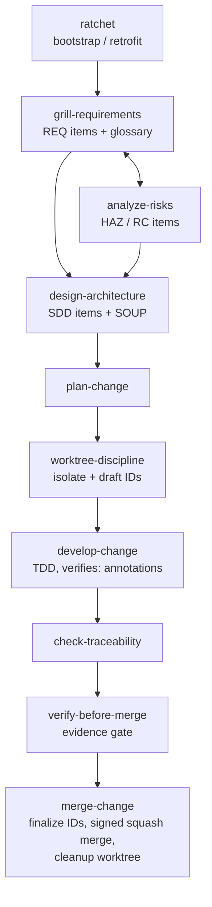

# guardrails

Agent skills for managing and developing software projects under
**IEC 62304** (medical device software lifecycle) and **ISO 14971**
(risk management), with mechanically checked traceability, mandatory git
worktrees, and signed squash merges.

> Guardrails supports your quality management system; it is **not** itself
> regulatory compliance. Your quality manual, design controls, and human
> sign-offs govern.

## Install

```sh
git clone <this repo>
cd guardrails
./install.sh          # symlinks skills into ~/.claude/skills
                      # (CLAUDE_SKILLS_DIR overrides; --copy for a static copy)
```

Then, in the project you want to bring under guardrails, run the **ratchet**
skill (`/ratchet`). It bootstraps a new project — or audits an existing one
and tightens incrementally — installing `AGENTS.md` rules, `.guardrails/`
config and check scripts, and the document skeletons, and finishing with a
checklist of things only a human can set up (signing keys, branch
protection, CI).

## The workflow



Three rules carry the whole system:

1. **All work happens in worktrees** — documentation and code alike. Main
   never moves except by merge.
2. **Integration is a signed squash merge** — main is one signed, verified,
   auditable commit per change.
3. **Traceability is mechanical** — grep-able IDs link requirements, risks,
   design, and tests; scripts gate every merge.

## ID and trace grammar

| Item | Defined in | Grammar |
|---|---|---|
| Requirement | `docs/requirements/srs.md` | `**REQ-NNN**: The software shall … (implements: RC-NNN)` |
| Hazard | `docs/risk/rmf.md` | `**HAZ-NNN**: hazard, situation, harm. Severity: S_. Probability: P_.` |
| Risk control | `docs/risk/rmf.md` | `**RC-NNN**: control. mitigates: HAZ-NNN` |
| Design item | `docs/architecture/sad.md` | `**SDD-NNN**: item. traces: REQ-NNN` |
| Test link | test files | comment/name containing `verifies: REQ-NNN, RC-NNN` |

New items minted inside a worktree use **draft IDs**
(`<PREFIX>-DRAFT-<branch>-<n>`); `finalize-ids.sh` assigns the next
sequential numbers at merge time and rewrites every reference — parallel
worktrees can never collide on an ID.

## Check scripts

Source of truth in `scripts/`; `/ratchet` copies them into target projects
at `.guardrails/scripts/`. POSIX sh + git/grep/awk/sed only.

| Script | Purpose |
|---|---|
| `check-ids.sh [--allow-drafts] [--base REF]` | no leftover drafts, no duplicate IDs |
| `check-trace.sh` | every REQ tested, HAZ mitigated, RC implemented, SDD traced; no dangling refs |
| `check-signing.sh [--strict] [RANGE]` | commit signatures verified |
| `finalize-ids.sh [--dry-run] [--base REF]` | mint final IDs, rewrite references |

Safety-class awareness (IEC 62304 A/B/C) lives in `.guardrails/config.yaml`;
skills scale required documentation and verification to the class.

## Development

```sh
tests/run-tests.sh    # bats suite for the scripts (vendors bats-core if needed)
```

Guardrails is developed under its own rules — see `AGENTS.md`.

## Credits

Process discipline adapted from [obra/superpowers](https://github.com/obra/superpowers)
(worktrees, TDD, verification-before-completion, plan writing) and interview
style from [mattpocock/skills](https://github.com/mattpocock/skills)
(`grilling`, `domain-modeling`, `grill-with-docs`) — both MIT licensed.

## License

MIT © Dr. Jan-Jan van der Vyver — see [LICENSE](LICENSE).
