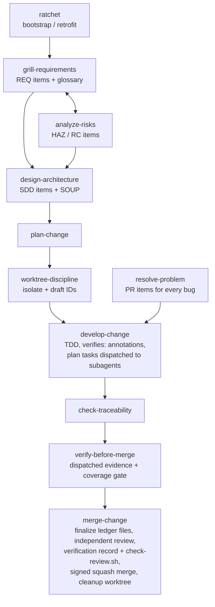

# guardrails

Agent skills for managing and developing software projects under
**IEC 62304** (medical device software lifecycle) and **ISO 14971**
(risk management), with mechanically checked traceability, mandatory git
worktrees, and signed squash merges. Borrows DO-178C's strongest mechanics:
high/low-level requirements, derived-requirements feedback into risk
analysis, problem reports, structural-coverage targets, independent review,
and verification records.

> Guardrails supports your quality management system; it is **not** itself
> regulatory compliance. Your quality manual, design controls, and human
> sign-offs govern.

## Install

Via the [skills CLI](https://skills.sh) (Claude Code, Cursor, Codex, and
other agents):

```sh
npx skills add Jan-Jan/guardrails
```

Or manually:

```sh
git clone git@github.com:Jan-Jan/guardrails.git
cd guardrails
./install.sh          # symlinks skills into ~/.claude/skills
                      # (CLAUDE_SKILLS_DIR overrides; --copy for a static copy)
```

Then, in the project you want to bring under guardrails, run the **ratchet**
skill (`/ratchet`). It bootstraps a new project — or audits an existing one
and tightens incrementally — installing `AGENTS.md` rules, `.guardrails/`
config and check scripts, and the document skeletons, and finishing with a
checklist of things only a human can set up (signing keys, branch
protection, CI).

## The workflow


```mermaid
flowchart TD
    R[ratchet<br/>bootstrap / retrofit] --> G[grill-requirements<br/>REQ items + glossary]
    G <--> A[analyze-risks<br/>HAZ / RC items]
    G --> D[design-architecture<br/>SDD items + SOUP]
    A --> D
    D --> P[plan-change]
    P --> W[worktree-discipline<br/>isolate + draft IDs]
    W --> DEV[develop-change<br/>TDD, verifies: annotations,<br/>plan tasks dispatched to subagents]
    B[resolve-problem<br/>PR items for every bug] --> DEV
    DEV --> CT[check-traceability]
    CT --> V[verify-before-merge<br/>dispatched evidence + coverage gate]
    V --> M[merge-change<br/>finalize ledger files, independent review,<br/>verification record + check-review.sh,<br/>signed squash merge, cleanup worktree]
```

Three rules define the whole system:

1. **All work happens in worktrees**, documentation and code alike. One change
   gets one change worktree on one change branch, and the base branch moves
   only by merge.
2. **Integration is a signed squash merge.** The base branch receives one
   signed, verified commit per change; the user signs it, and
   `finish-merge.sh` cleans up only after its guards pass.
3. **Traceability is mechanical.** Grep-able IDs link requirements, risks,
   design and tests, and scripts gate every merge.

Within a change, the main agent orchestrates. Each plan task goes to a
subagent in its own task worktree, and the dispatcher merges the task branch
back. Changes are sequential; parallel work happens only inside a change.

## Check scripts

`scripts/` is the source of truth; `/ratchet` copies the scripts into a target
project at `.guardrails/scripts/`. Each script's header comment states its
rules, reports and exit codes in full.

| Script | Purpose |
|---|---|
| `new-id.sh` | Mint item IDs. |
| `find-items.sh` | List, show and find references to ledger items without reading whole ledgers. |
| `check-ids.sh` | Draft IDs, draft-named ledger files, duplicate and malformed IDs. |
| `check-trace.sh` | The traceability and problem-report gates, with the `checked:`, `problems:` and `sources:` summary. |
| `check-units.sh` | The multi-unit repository: manifest validation, unit claims, the class floor, the impact set. |
| `check-review.sh` | The verification record of the change under merge, and its findings. |
| `check-signing.sh` | Commit signatures, and with `--setup` proof that the project can sign. |
| `finalize-docs.sh` | Rename this change's draft ledger files to dated names and rewrite references to them. |
| `merge-preflight.sh` | The mechanical checks of `merge-change` steps 4 and 6c, in one command. |
| `finish-merge.sh` | The guarded cleanup half of the signed merge command the user runs. |
| `task-worktree.sh` | Create, merge and retire a task worktree nested in the change worktree. |

## Where the rules live

`README.md` states no rule of its own. Each rule is stated by its owner, in
one of these places:

- **The skills**, `skills/<name>/SKILL.md`, state each step of the workflow.
  Reasons, worked examples and conditional material are in
  `skills/<name>/references/`.
- **The ledger templates**, `templates/srs.md`, `rmf.md`, `sad.md` and
  `problems.md`, state the item grammar and the ledger layout. `/ratchet`
  installs each as its ledger directory's `README.md`.
  `templates/verification.md` states the verification record's fields.
- **The script headers** state what each check reports, and why.
- **`skills/check-traceability/references/config.md`** states the config
  rules.
- **`docs/plans/2026-09-03-units-architecture.md`** is the design of
  multi-unit repositories.
- **`AGENTS.md`** states the rules for developing guardrails itself.

## Development

```sh
tests/run-tests.sh    # bats suite for the scripts (vendors bats-core if needed)
```

Guardrails is developed under its own rules — see `AGENTS.md`.

## Credits

Process discipline adapted from [obra/superpowers](https://github.com/obra/superpowers)
(worktrees, TDD, verification-before-completion, plan writing) and interview
style from [mattpocock/skills](https://github.com/mattpocock/skills)
(`grilling`, `domain-modeling`, `grill-with-docs`) — both MIT licensed.

## License

MIT © Dr. Jan-Jan van der Vyver — see [LICENSE](LICENSE).
